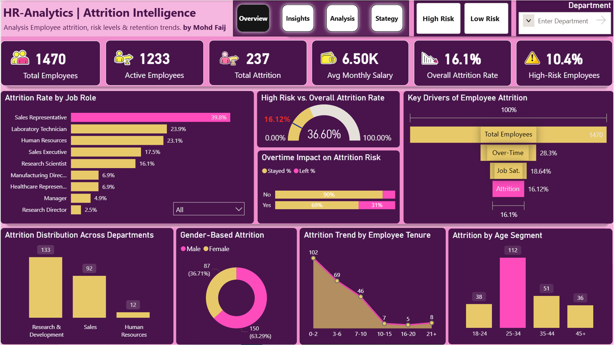
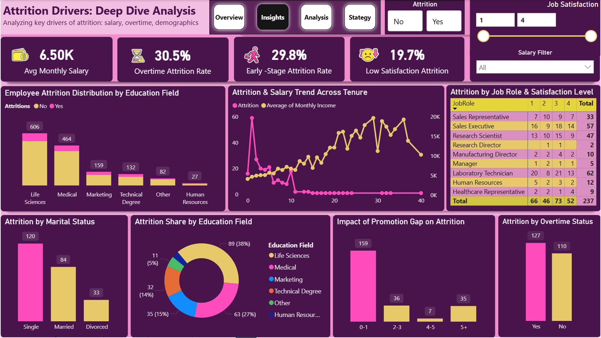
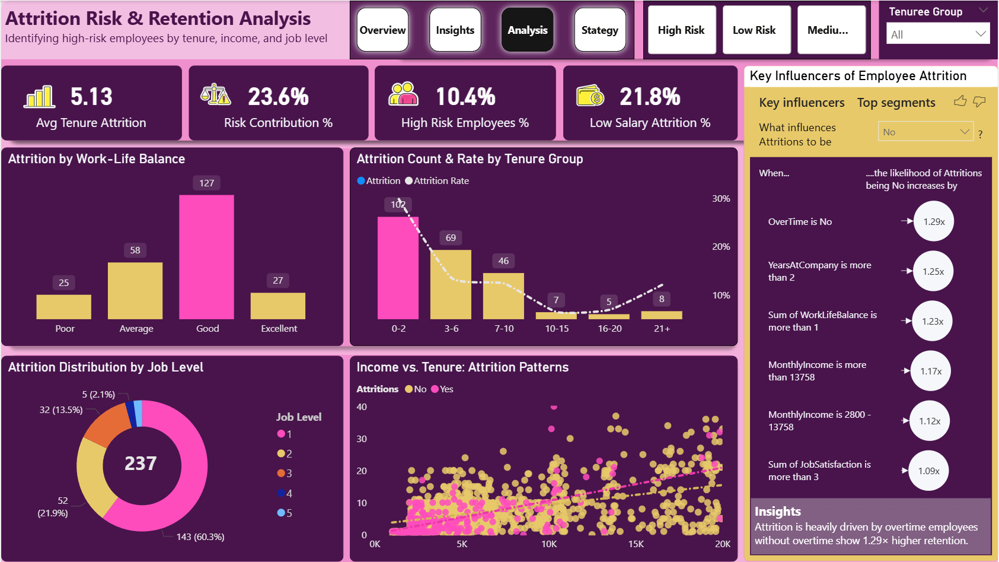
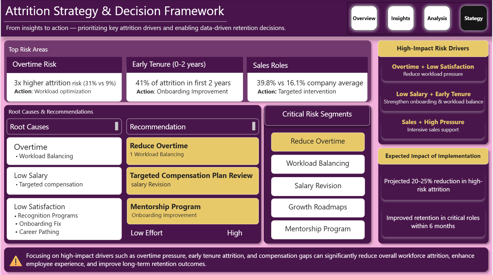

<div align="center">

<br/>

<!-- ████████████████████████  BADGE STRIP  ████████████████████████ -->


&nbsp;

&nbsp;

&nbsp;

&nbsp;

&nbsp;


<br/><br/>

<!-- ████████████████████████  TITLE BLOCK  ████████████████████████ -->

```
██╗  ██╗██████╗      █████╗ ███╗   ██╗ █████╗ ██╗  ██╗   ██╗████████╗██╗ ██████╗███████╗
██║  ██║██╔══██╗    ██╔══██╗████╗  ██║██╔══██╗██║  ╚██╗ ██╔╝╚══██╔══╝██║██╔════╝██╔════╝
███████║██████╔╝    ███████║██╔██╗ ██║███████║██║   ╚████╔╝    ██║   ██║██║     ███████╗
██╔══██║██╔══██╗    ██╔══██║██║╚██╗██║██╔══██║██║    ╚██╔╝     ██║   ██║██║     ╚════██║
██║  ██║██║  ██║    ██║  ██║██║ ╚████║██║  ██║███████╗██║      ██║   ██║╚██████╗███████║
╚═╝  ╚═╝╚═╝  ╚═╝   ╚═╝  ╚═╝╚═╝  ╚═══╝╚═╝  ╚═╝╚══════╝╚═╝      ╚═╝   ╚═╝ ╚═════╝╚══════╝
```

# 🔍 Employee Attrition Intelligence

### *A 4-page Power BI intelligence system — from raw workforce data to executive retention strategy*

<table>
<tr>
<td align="center"><b>👥 Employees</b><br/>1,470</td>
<td align="center"><b>📉 Attritions</b><br/>237</td>
<td align="center"><b>⚠️ Attrition Rate</b><br/>16.1%</td>
<td align="center"><b>💰 Avg Salary</b><br/>$6.50K/mo</td>
<td align="center"><b>🔴 High Risk</b><br/>10.4%</td>
<td align="center"><b>📊 Dashboard Pages</b><br/>4</td>
</tr>
</table>

<sub>Designed & developed by <b>Mohd Faij</b> &nbsp;·&nbsp; IBM HR Analytics Dataset &nbsp;·&nbsp; Power BI Desktop</sub>

<br/>

</div>

---

<!-- ████████████████████████  LIVE DASHBOARD  ████████████████████████ -->

<div align="center">

## ▶️ Live Dashboard

<a href="https://app.powerbi.com/view?r=eyJrIjoiOWJiNTE4MzgtMDY2ZS00MzMyLWFhYjEtMzQyNGQxY2VkZWZlIiwidCI6IjNkMGE5Y2FiLTQzYzYtNDlkNi1iODZjLTFiMTZjNGQwMjYzNSJ9&pageName=b81ffae9177e924195ab">

</a>

<br/><br/>

> *Click the button above to explore the fully interactive dashboard on Power BI Service.*
> *All slicers, filters, drill-throughs, and the AI Key Influencers visual are live.*

<br/>

[](YOUR_PBIX_FILE_LINK_HERE)
&nbsp;&nbsp;
[](https://www.kaggle.com/datasets/pavansubhasht/ibm-hr-analytics-attrition-dataset)
&nbsp;&nbsp;
[](www.linkedin.com/in/mohdfaij-data)
&nbsp;&nbsp;
[](mohdfaij-data.github.io)

</div>

---

<!-- ████████████████████████  WHAT IS THIS  ████████████████████████ -->

## 🧠 What Is This Dashboard?

This is **not** a standard HR report with a few bar charts. It is a **four-layer intelligence system** built entirely in Power BI that guides an organization through the complete attrition analysis journey — from *"what is happening?"* all the way to *"what should we do about it and what ROI can we expect?"*

```
┌─────────────────────────────────────────────────────────────────────────────┐
│                                                                             │
│   PAGE 1 ──► SIGNAL       What is happening across the workforce?          │
│   PAGE 2 ──► DIAGNOSIS    Why are employees leaving?                       │
│   PAGE 3 ──► PREDICTION   Who is most at risk — and what predicts it?      │
│   PAGE 4 ──► ACTION       What should leadership do — and what ROI?        │
│                                                                             │
└─────────────────────────────────────────────────────────────────────────────┘
```

| Layer | Page | Audience | Core Question |
|-------|------|----------|---------------|
| 📡 **Signal** | Overview | C-Suite, HR Directors | What is the attrition picture right now? |
| 🔬 **Diagnosis** | Insights | HR Analysts, BPs | Which drivers are causing people to leave? |
| 🧬 **Prediction** | Analysis | People Analytics Teams | Who is at risk and what predicts attrition? |
| 🎯 **Action** | Strategy | Senior Leadership | What interventions will actually reduce attrition? |

---

<!-- ████████████████████████  DASHBOARD PREVIEWS  ████████████████████████ -->

## 📸 Dashboard Screenshots & Deep-Dive Analysis

---

### 🖥️ Page 1 — Overview: Attrition Command Center

> **Subtitle:** *Analysis of employee attrition, risk levels & retention trends — by Mohd Faij*

---

#### 📸 Screenshot



<div align="center"><sub>↑ Page 1 · Overview — Full executive dashboard snapshot</sub></div>

---

#### 📝 Page Summary

The Overview page is the **executive command centre** of the entire dashboard. Built around six live KPI cards and eight supporting visuals, it delivers the complete workforce picture at a single glance — total headcount, active employees, total attritions, average monthly salary, overall attrition rate, and the proportion of high-risk employees. Every metric responds dynamically to the **Department**, **High Risk**, and **Low Risk** slicers in the navigation bar, allowing HR directors to isolate any segment in one click. This page answers the most critical first question a leadership team asks: *what is actually happening right now?*

---

#### 📊 KPI Cards

| # | KPI Card | Value | What It Measures |
|---|----------|-------|-----------------|
| 1 | 👥 Total Employees | **1,470** | Full headcount in the dataset |
| 2 | ✅ Active Employees | **1,233** | Employees still with the company |
| 3 | 📉 Total Attritions | **237** | Employees who have left |
| 4 | 💰 Avg Monthly Salary | **$6.50K** | Mean monthly income across all employees |
| 5 | ⚠️ Overall Attrition Rate | **16.1%** | % of workforce that left |
| 6 | 🔴 High Risk Employees | **10.4%** | % flagged as high attrition risk |

---

#### 📈 Visuals on This Page

| Visual Type | Chart Title | Key Data Point |
|-------------|-------------|----------------|
| 📊 Horizontal Bar | Attrition Rate by Job Role | Sales Rep leads at **39.8%** |
| 🎯 Gauge Chart | High Risk vs. Overall Attrition Rate | High Risk: **36.60%**, Overall: **16.12%** |
| 📈 Stacked Bar | Overtime Impact on Attrition Risk | OT employees: **31% left** vs 10% without OT |
| 🔑 Bar Visual | Key Drivers of Employee Attrition | OverTime (28.3%), Job Sat (18.64%), Attrition (16.12%) |
| 📊 Clustered Bar | Attrition Distribution Across Departments | R&D: **133**, Sales: **92**, HR: **12** |
| 🍩 Donut Chart | Gender-Based Attrition | Male: **63.29%**, Female: **36.71%** |
| 📉 Area/Line Chart | Attrition Trend by Employee Tenure | Peak at **0-2 yrs (102)**, drops to 5 at 16-20 yrs |
| 📊 Grouped Bar | Attrition by Age Segment | **25-34** dominates at **112 attritions** |

**Slicers:** `Department` · `High Risk` · `Low Risk`

---

#### 🔍 Key Insights from Page 1

```
◆  Sales Representatives leave at 39.8% — 2.5× the company average of 16.1%
◆  Overtime employees leave at 3× the rate of non-overtime employees (31% vs 10%)
◆  25-34 age group has the highest attrition at 112 — the most critical talent segment
◆  R&D loses the most employees in absolute volume (133) despite being the largest dept
◆  102 of 237 total attritions (43%) happen within the first 0-2 years of employment
◆  Male employees account for 63.29% of attritions vs 36.71% female
```

---
---

### 🔬 Page 2 — Insights: Attrition Drivers Deep Dive

> **Subtitle:** *Analyzing key drivers of attrition: salary, overtime, demographics*

---

#### 📸 Screenshot



<div align="center"><sub>↑ Page 2 · Insights — Deep dive into attrition root causes</sub></div>

---

#### 📝 Page Summary

The Insights page moves from *what* to *why*. It connects six key attrition drivers — salary trajectory, overtime behaviour, education background, marital status, promotion gaps, and job satisfaction — into one analytical canvas. Designed for **HR analysts and business partners**, this page surfaces the hidden patterns behind the headline numbers. Three interactive slicers (Attrition Yes/No, Job Satisfaction 1–4 slider, and Salary Band filter) allow any combination of drill-down, making it ideal for testing hypotheses in real time. This is the page where data-driven retention conversations begin.

---

#### 📊 KPI Cards

| # | KPI Card | Value | What It Measures |
|---|----------|-------|-----------------|
| 1 | 💰 Avg Monthly Salary | **$6.50K** | Baseline salary context for analysis |
| 2 | ⏰ Overtime Attrition Rate | **30.5%** | Attrition rate among overtime employees |
| 3 | 🚶 Early-Stage Attrition Rate | **29.8%** | Attrition rate for employees in first 2 years |
| 4 | 😞 Low Satisfaction Attrition | **19.7%** | Attrition rate for low job satisfaction employees |

---

#### 📈 Visuals on This Page

| Visual Type | Chart Title | Key Data Point |
|-------------|-------------|----------------|
| 📊 Clustered Bar | Attrition Distribution by Education Field | Life Sciences: **606**, Medical: **464** |
| 📈 Dual-Axis Line | Attrition & Salary Trend Across Tenure | Attrition peaks at **Year 1**, salary grows to **$20K** |
| 🗃️ Matrix Table | Attrition by Job Role & Satisfaction Level | Lab Technician leads with **62 total** attritions |
| 📊 Bar Chart | Attrition by Marital Status | Single: **120**, Married: **84**, Divorced: **33** |
| 🍩 Donut Chart | Attrition Share by Education Field | Life Sciences: **38%** of all attritions |
| 📊 Bar Chart | Impact of Promotion Gap on Attrition | 0-1 yr gap: **159 attritions** (highest) |
| 📊 Bar Chart | Attrition by Overtime Status | Yes: **127**, No: **110** |

**Slicers:** `Attrition (Yes/No)` · `Job Satisfaction (1–4 slider)` · `Salary Band`

---

#### 🔍 Key Insights from Page 2

```
◆  Life Sciences has 606 attrition-affected employees — nearly double Medical (464)
◆  Attrition spikes sharply at Year 1 of tenure, then consistently declines as salary grows
◆  Single employees leave most (120) — 43% more than married employees (84)
◆  Employees with 0-1 year promotion gap = 159 attritions — the biggest promotion risk group
◆  Overtime workers: 127 attritions vs 110 without OT — disproportionate given smaller headcount
◆  Lab Technicians have the highest attritions (62) across ALL satisfaction score levels
```

---
---

### ⚠️ Page 3 — Analysis: Attrition Risk & Retention Analysis

> **Subtitle:** *Identifying high-risk employees by tenure, income, and job level*

---

#### 📸 Screenshot



<div align="center"><sub>↑ Page 3 · Analysis — AI-powered risk identification and retention patterns</sub></div>

---

#### 📝 Page Summary

The Analysis page is the **most technically advanced page** of the dashboard. It shifts from descriptive to predictive — using Power BI's native **AI Key Influencers visual** alongside scatter plots, combo bar+line charts, and donut breakdowns to quantify *exactly* which conditions predict attrition with statistical confidence. Rather than just counting who left, this page models the probability of leaving based on overtime status, tenure, income level, work-life balance rating, and job satisfaction score. Built for **people analytics teams** who need to act before employees resign, with four slicers for precision segmentation.

---

#### 📊 KPI Cards

| # | KPI Card | Value | What It Measures |
|---|----------|-------|-----------------|
| 1 | 📅 Avg Tenure at Attrition | **5.13 years** | Average company tenure when employees leave |
| 2 | 📊 Risk Contribution % | **23.6%** | High-risk employees as share of all attritions |
| 3 | 🔴 High Risk Employees % | **10.4%** | % of total workforce flagged high risk |
| 4 | 💸 Low Salary Attrition % | **21.8%** | Attrition rate among lowest salary band |

---

#### 📈 Visuals on This Page

| Visual Type | Chart Title | Key Data Point |
|-------------|-------------|----------------|
| 📊 Clustered Bar | Attrition by Work-Life Balance | "Good" rating: **127** attritions — highest of all ratings |
| 📊 Combo Bar+Line | Attrition Count & Rate by Tenure Group | 0-2 yrs: **102 attritions**, ~28% rate |
| 🍩 Donut Chart | Attrition Distribution by Job Level | Level 1: **60.3%**, Level 2: **21.9%** |
| 🔵 Scatter Plot | Income vs. Tenure: Attrition Patterns | Pink (Yes) clusters in **low income + low tenure** zone |
| 🤖 AI Visual | Key Influencers of Employee Attrition | 5 ranked predictors with multiplier values |

**Slicers:** `Tenure Group` · `High Risk` · `Medium Risk` · `Low Risk`

---

#### 🤖 AI Key Influencers — Full Breakdown

> *Power BI's Key Influencers visual analysed the dataset and ranked the following factors by their statistical impact on whether an employee stays or leaves:*

| Rank | Condition | Retention Multiplier | Interpretation |
|------|-----------|---------------------|----------------|
| 🥇 1 | OverTime = **No** | **1.29×** more likely to stay | Strongest single predictor — removing OT has the biggest impact |
| 🥈 2 | YearsAtCompany > **2** | **1.25×** more likely to stay | Surviving year 2 is a major retention milestone |
| 🥉 3 | WorkLifeBalance > **1** | **1.23×** more likely to stay | Even modest WLB improvement significantly reduces risk |
| 4 | MonthlyIncome > **$13,758** | **1.17×** more likely to stay | Clear salary threshold above which retention improves sharply |
| 5 | MonthlyIncome **$2,800–$13,758** | **1.12×** more likely to stay | Mid-range income still offers notable protection vs. lowest band |
| 6 | JobSatisfaction > **3** | **1.09×** more likely to stay | High satisfaction provides modest but measurable lift |

> **AI Summary (from dashboard):** *"Attrition is heavily driven by overtime — employees without overtime show 1.29× higher retention."*

---

#### 🔍 Key Insights from Page 3

```
◆  Job Level 1 = 60.3% of all attritions — entry-level is the single biggest retention lever
◆  No overtime = 1.29× more likely to stay — the strongest predictor found by AI analysis
◆  Income above $13,758/month = 1.17× retention — a clear, actionable salary threshold
◆  0-2 year tenure = 102 attritions at ~28% rate — highest risk window in entire workforce
◆  Paradox: "Good" work-life balance had the HIGHEST attrition count (127) — not "Poor"
◆  Attrition (pink) clusters in low income + low tenure scatter zone — compound risk confirmed
```

---
---

### 🎯 Page 4 — Strategy: Attrition Strategy & Decision Framework

> **Subtitle:** *From data to action — 3× higher attrition with overtime. 41% of attrition in first 2 years.*

---

#### 📸 Screenshot



<div align="center"><sub>↑ Page 4 · Strategy — Boardroom-ready decision framework with projected ROI</sub></div>

---

#### 📝 Page Summary

The Strategy page is the **"so what?"** of the entire dashboard. It translates three pages of analysis into a **boardroom-ready action plan** that any senior leader can pick up and act on — without needing to understand a single chart. Root causes are mapped directly to prioritised recommendations. Interventions are ranked on an effort-vs-impact scale. Risk segments are clearly named. And projected outcomes are quantified. This page is intentionally static and narrative-driven — designed to be dropped into an executive slide deck, presented in a board meeting, or shared with an HR committee with zero additional context required.

---

#### 🔴 Top Risk Areas Identified

| Risk Area | Key Statistic | Evidence | Recommended Action |
|-----------|--------------|----------|--------------------|
| ⏰ **Overtime Risk** | **3× higher attrition** | 31% OT vs 9% non-OT attrition rate | Audit overtime-heavy roles first |
| 🚶 **Early Tenure (0–2 yrs)** | **41% of all attritions** | 102 of 237 total attritions | Fix onboarding & first-year experience |
| 💼 **Sales Roles** | **39.8% attrition rate** | vs 16.1% company average | Targeted role-specific retention plan |

---

#### 🗺️ Root Cause → Recommendation Map

| Root Cause | Sub-Drivers | Recommendation | Effort Level | Impact |
|------------|-------------|----------------|--------------|--------|
| ⏰ **Overtime** | Workload imbalance | **Reduce Overtime + Workload Balancing** | High | 🔴 Critical |
| 💰 **Low Salary** | Below-market compensation | **Targeted Compensation Plan Review** | High | 🔴 Critical |
| 😞 **Low Satisfaction** | Recognition, career pathing, onboarding | **Mentorship Program + Onboarding Fix** | Low | 🟡 High Return |

---

#### 🏹 Critical Risk Segment Priority Stack

```
Priority 1  →  Reduce Overtime          (immediate, highest ROI)
Priority 2  →  Workload Balancing        (structural fix)
Priority 3  →  Salary Revision           (compensation review)
Priority 4  →  Growth Roadmaps           (career development)
Priority 5  →  Mentorship Program        (quick win, low effort)
```

---

#### 🎯 Compound Risk Segments (from dashboard right panel)

| Compound Risk | Description | Strategy |
|---------------|-------------|----------|
| 🔴 Overtime + Low Satisfaction | Highest attrition probability | Reduce pricing demand immediately |
| 🟠 Low Salary + Early Tenure | Second-highest risk segment | Strengthen onboarding & workload balance |
| 🟡 Sales + High Pressure | Role-specific compound risk | Intensive sales support & recognition |

---

#### 📈 Expected Impact of Implementation

| Intervention | Timeline | Expected Outcome |
|---|---|---|
| Reduce overtime in high-risk roles | 0–3 months | Up to **3× lower attrition** in affected group |
| Strengthen onboarding (0–2 yr employees) | 0–3 months | Address **41% of total attrition** at its source |
| Targeted compensation review | 3–6 months | Retention uplift via **1.17× income threshold effect** |
| Mentorship + career pathing | 1–6 months | **20–25% projected reduction** in high-risk attrition |
| All interventions combined | 6 months | Improved retention in **all critical roles within 6 months** |

---

#### 🔍 Key Insights from Page 4

```
◆  3 critical risk areas have clear, data-backed root causes with defined actions
◆  Overtime + Low Satisfaction is the most dangerous compound risk segment
◆  Reduce Overtime & Compensation Review = highest impact, regardless of effort
◆  Mentorship Program = lowest effort, high return — ideal immediate quick win
◆  Full implementation projected to reduce high-risk attrition by 20-25%
◆  All retention improvements achievable within 6 months of implementation start
```

---

<!-- ████████████████████████  KEY FINDINGS  ████████████████████████ -->

## 💡 Master Key Findings — All Pages Combined

```
╔══════════════════════════════════════════════════════════════════════════════╗
║                        CRITICAL FINDINGS                                    ║
╠══════════════════════════════════════════════════════════════════════════════╣
║  🔴  Overtime employees leave at 3× the rate of non-OT employees (31% vs 9%)║
║  🔴  41% of ALL attrition occurs within the first 2 years of employment      ║
║  🔴  Job Level 1 = 60.3% of all attritions — entry level is the core leak    ║
╠══════════════════════════════════════════════════════════════════════════════╣
║                         HIGH FINDINGS                                        ║
╠══════════════════════════════════════════════════════════════════════════════╣
║  🟠  Sales Reps have the highest role attrition at 39.8% vs 16.1% avg        ║
║  🟠  Low salary + early tenure = highest compound attrition risk segment      ║
║  🟠  Employees with 0-1 yr promotion gap = 159 attritions (highest group)    ║
╠══════════════════════════════════════════════════════════════════════════════╣
║                        INSIGHTS & PARADOXES                                  ║
╠══════════════════════════════════════════════════════════════════════════════╣
║  🟢  Employees earning >$13,758/month are 1.17× more likely to stay          ║
║  🟢  "Good" work-life balance had the HIGHEST attrition count (127) — paradox║
║  🟢  Single employees leave at the highest rate of any marital status group   ║
║  🟢  Surviving year 2 at a company makes employees 1.25× more likely to stay ║
╚══════════════════════════════════════════════════════════════════════════════╝
```

---

<!-- ████████████████████████  DAX  ████████████████████████ -->

## 🧮 DAX Measures — Complete Reference

<details>
<summary><b>📌 1. Core Attrition Measures</b></summary>

```dax
-- ── Total Employees ──────────────────────────────────────────────────────
Total Employees = COUNTROWS(HR_Data)

-- ── Total Attritions ─────────────────────────────────────────────────────
Total Attritions = 
CALCULATE(
    COUNTROWS(HR_Data),
    HR_Data[Attrition] = "Yes"
)

-- ── Active Employees ─────────────────────────────────────────────────────
Active Employees = 
CALCULATE(
    COUNTROWS(HR_Data),
    HR_Data[Attrition] = "No"
)

-- ── Overall Attrition Rate ────────────────────────────────────────────────
Attrition Rate = 
DIVIDE(
    [Total Attritions],
    [Total Employees],
    0
)

-- ── Stayed % (for Overtime visual) ───────────────────────────────────────
Stayed % = 
DIVIDE(
    CALCULATE(COUNTROWS(HR_Data), HR_Data[Attrition] = "No"),
    COUNTROWS(HR_Data),
    0
)

-- ── Left % (for Overtime visual) ─────────────────────────────────────────
Left % = 
DIVIDE(
    [Total Attritions],
    COUNTROWS(HR_Data),
    0
)
```

</details>

<details>
<summary><b>📌 2. Risk & High Risk Measures</b></summary>

```dax
-- ── High Risk Employee Count ─────────────────────────────────────────────
High Risk Employees = 
CALCULATE(
    COUNTROWS(HR_Data),
    HR_Data[RiskCategory] = "High"
)

-- ── High Risk Employees % ────────────────────────────────────────────────
High Risk Employees % = 
DIVIDE(
    [High Risk Employees],
    [Total Employees],
    0
)

-- ── Risk Contribution % (High Risk as % of Attritions) ───────────────────
Risk Contribution % = 
DIVIDE(
    [High Risk Employees],
    [Total Attritions],
    0
)

-- ── Low Salary Attrition % ───────────────────────────────────────────────
Low Salary Attrition % = 
DIVIDE(
    CALCULATE([Total Attritions], HR_Data[SalaryBand] = "Low"),
    [Total Attritions],
    0
)
```

</details>

<details>
<summary><b>📌 3. Salary & Compensation Measures</b></summary>

```dax
-- ── Average Monthly Salary ───────────────────────────────────────────────
Avg Monthly Salary = 
AVERAGE(HR_Data[MonthlyIncome])

-- ── Average Salary by Department ─────────────────────────────────────────
Avg Salary by Dept = 
CALCULATE(
    AVERAGE(HR_Data[MonthlyIncome]),
    ALLEXCEPT(HR_Data, HR_Data[Department])
)

-- ── Average Salary — Attrition Yes ───────────────────────────────────────
Avg Salary Attrition Yes = 
CALCULATE(
    AVERAGE(HR_Data[MonthlyIncome]),
    HR_Data[Attrition] = "Yes"
)

-- ── Average Salary — Attrition No ────────────────────────────────────────
Avg Salary Attrition No = 
CALCULATE(
    AVERAGE(HR_Data[MonthlyIncome]),
    HR_Data[Attrition] = "No"
)
```

</details>

<details>
<summary><b>📌 4. Overtime & Tenure Measures</b></summary>

```dax
-- ── Overtime Attrition Rate ──────────────────────────────────────────────
Overtime Attrition Rate = 
CALCULATE(
    [Attrition Rate],
    HR_Data[OverTime] = "Yes"
)

-- ── Early Stage Attrition Rate (0–2 years) ───────────────────────────────
Early Stage Attrition Rate = 
CALCULATE(
    [Attrition Rate],
    HR_Data[YearsAtCompany] <= 2
)

-- ── Average Tenure at Time of Attrition ──────────────────────────────────
Avg Tenure Attrition = 
CALCULATE(
    AVERAGE(HR_Data[YearsAtCompany]),
    HR_Data[Attrition] = "Yes"
)

-- ── Attrition Count by Tenure Group ──────────────────────────────────────
Attrition by Tenure Group = 
CALCULATE(
    [Total Attritions],
    ALLEXCEPT(HR_Data, HR_Data[TenureGroup])
)

-- ── Attrition Rate by Tenure Group ───────────────────────────────────────
Attrition Rate by Tenure = 
DIVIDE(
    CALCULATE([Total Attritions], ALLEXCEPT(HR_Data, HR_Data[TenureGroup])),
    CALCULATE(COUNTROWS(HR_Data), ALLEXCEPT(HR_Data, HR_Data[TenureGroup])),
    0
)
```

</details>

<details>
<summary><b>📌 5. Satisfaction & Demographic Measures</b></summary>

```dax
-- ── Low Satisfaction Attrition Rate ──────────────────────────────────────
Low Satisfaction Attrition = 
CALCULATE(
    [Attrition Rate],
    HR_Data[JobSatisfaction] <= 2
)

-- ── Male Attrition Count ─────────────────────────────────────────────────
Male Attrition = 
CALCULATE([Total Attritions], HR_Data[Gender] = "Male")

-- ── Male Attrition % ─────────────────────────────────────────────────────
Male Attrition % = 
DIVIDE([Male Attrition], [Total Attritions], 0)

-- ── Female Attrition % ───────────────────────────────────────────────────
Female Attrition % = 
DIVIDE(
    CALCULATE([Total Attritions], HR_Data[Gender] = "Female"),
    [Total Attritions],
    0
)

-- ── Department Attrition Count ────────────────────────────────────────────
Dept Attrition = 
CALCULATE(
    [Total Attritions],
    ALLEXCEPT(HR_Data, HR_Data[Department])
)

-- ── Attrition Rate by Department ─────────────────────────────────────────
Dept Attrition Rate = 
DIVIDE(
    CALCULATE([Total Attritions], ALLEXCEPT(HR_Data, HR_Data[Department])),
    CALCULATE(COUNTROWS(HR_Data), ALLEXCEPT(HR_Data, HR_Data[Department])),
    0
)
```

</details>

<details>
<summary><b>📌 6. Calculated Columns (DAX)</b></summary>

```dax
-- ── Age Segment ──────────────────────────────────────────────────────────
Age Segment = 
SWITCH(
    TRUE(),
    HR_Data[Age] >= 18 && HR_Data[Age] <= 24, "18-24",
    HR_Data[Age] >= 25 && HR_Data[Age] <= 34, "25-34",
    HR_Data[Age] >= 35 && HR_Data[Age] <= 44, "35-44",
    HR_Data[Age] >= 45,                        "45+",
    "Unknown"
)

-- ── Tenure Group ─────────────────────────────────────────────────────────
Tenure Group = 
SWITCH(
    TRUE(),
    HR_Data[YearsAtCompany] <= 2,  "0-2",
    HR_Data[YearsAtCompany] <= 6,  "3-6",
    HR_Data[YearsAtCompany] <= 10, "7-10",
    HR_Data[YearsAtCompany] <= 15, "10-15",
    HR_Data[YearsAtCompany] <= 20, "16-20",
    "21+"
)

-- ── Risk Category ────────────────────────────────────────────────────────
-- High:   Overtime + Low Satisfaction (≤2) + Early Tenure (≤2 yrs)
-- Medium: Overtime only OR Low Satisfaction only
-- Low:    Neither condition
Risk Category = 
SWITCH(
    TRUE(),
    HR_Data[OverTime] = "Yes"
        && HR_Data[JobSatisfaction] <= 2
        && HR_Data[YearsAtCompany] <= 2, "High",
    HR_Data[OverTime] = "Yes"
        || HR_Data[JobSatisfaction] <= 2, "Medium",
    "Low"
)

-- ── Salary Band ──────────────────────────────────────────────────────────
Salary Band = 
SWITCH(
    TRUE(),
    HR_Data[MonthlyIncome] < 3000,  "Low",
    HR_Data[MonthlyIncome] < 7000,  "Mid",
    HR_Data[MonthlyIncome] < 13758, "Upper-Mid",
    "High"
)

-- ── Promotion Gap ─────────────────────────────────────────────────────────
-- How many years since last promotion relative to tenure
Promotion Gap = HR_Data[YearsAtCompany] - HR_Data[YearsSinceLastPromotion]

-- ── Attrition Binary (for scatter / AI visual compatibility) ─────────────
Attrition Binary = IF(HR_Data[Attrition] = "Yes", 1, 0)
```

</details>

---

<!-- ████████████████████████  DATA MODEL  ████████████████████████ -->

## 📐 Data Model

```
┌─────────────────────────────────────────────────────────────────────────┐
│               HR_Data  (Single Flat Fact Table)                         │
│               1,470 rows  ×  35 source columns                          │
│                                                                         │
│  ┌──────────────────────────────────────────────────────────────────┐  │
│  │  CALCULATED COLUMNS (DAX — added to source table)               │  │
│  │                                                                  │  │
│  │  Age Segment      →  "18-24" / "25-34" / "35-44" / "45+"        │  │
│  │  Tenure Group     →  "0-2" / "3-6" / "7-10" / "10-15" / "21+"  │  │
│  │  Risk Category    →  "High" / "Medium" / "Low"                  │  │
│  │  Salary Band      →  "Low" / "Mid" / "Upper-Mid" / "High"       │  │
│  │  Promotion Gap    →  YearsAtCompany - YearsSinceLastPromotion    │  │
│  │  Attrition Binary →  1 (Yes) / 0 (No)                           │  │
│  └──────────────────────────────────────────────────────────────────┘  │
│                                                                         │
│  ┌──────────────────────────────────────────────────────────────────┐  │
│  │  _MEASURES TABLE (separate DAX measures table)                  │  │
│  │                                                                  │  │
│  │  ├── Core Attrition Measures       (6 measures)                 │  │
│  │  ├── Risk & High Risk Measures     (4 measures)                 │  │
│  │  ├── Salary & Compensation         (4 measures)                 │  │
│  │  ├── Overtime & Tenure             (5 measures)                 │  │
│  │  └── Satisfaction & Demographics  (6 measures)                 │  │
│  └──────────────────────────────────────────────────────────────────┘  │
└─────────────────────────────────────────────────────────────────────────┘

Architecture: Single flat table · No relationships · All segmentation via
              calculated columns and DAX filter context (CALCULATE + ALLEXCEPT)
```

---

<!-- ████████████████████████  PROJECT STRUCTURE  ████████████████████████ -->

## 🗂️ Project Structure

```
📁 HR-Analytics-Employee-Attrition-Intelligence/
│
├── 📄 README.md                                    ← You are here
├── 📊 HR_Attrition_Intelligence.pbix               ← Main Power BI file (all 4 pages)
│
├── 📁 dataset/
│   ├── 📋 IBM_HR_Employee_Attrition.csv            ← Raw source dataset (1,470 × 35)
│   └── 📄 data_dictionary.md                       ← All 35 column definitions & types
│
├── 📁 screenshots/
│   ├── 🖼️ page1_overview.png                       ← Overview page full screenshot
│   ├── 🖼️ page2_insights.png                       ← Insights page full screenshot
│   ├── 🖼️ page3_analysis.png                       ← Analysis page full screenshot
│   └── 🖼️ page4_strategy.png                       ← Strategy page full screenshot
│
├── 📁 dax/
│   ├── 📝 01_core_attrition_measures.dax           ← Total, rate, active, stayed/left
│   ├── 📝 02_risk_measures.dax                     ← High risk %, risk contribution
│   ├── 📝 03_salary_measures.dax                   ← Avg salary, salary by segment
│   ├── 📝 04_overtime_tenure_measures.dax          ← OT rate, tenure, early-stage
│   ├── 📝 05_satisfaction_demographic_measures.dax ← Gender, satisfaction, dept
│   └── 📝 06_calculated_columns.dax                ← Age seg, tenure grp, risk cat
│
└── 📁 theme/
    └── 🎨 HR_Attrition_Theme.json                  ← Full custom dark gold Power BI theme
```


<!-- ████████████████████████  TOOLS  ████████████████████████ -->

## 🛠️ Tools & Technologies

| Tool | Version | Purpose |
|------|---------|---------|
| **Power BI Desktop** | Latest (2024) | Dashboard development, all visuals, publishing |
| **Power Query (M Language)** | Built-in | Data import, cleaning, transformation |
| **DAX** | Built-in | All 25+ measures + 6 calculated columns |
| **Power BI Theme JSON** | Custom | Ultra-dark gold visual theme |
| **Key Influencers Visual** | AI Visual (built-in) | Statistical attrition driver ranking (Page 3) |
| **Power BI Service** | Cloud | Live dashboard publishing & sharing |
| **IBM HR Analytics Dataset** | Kaggle | Source dataset — 1,470 employees × 35 attributes |

---

<!-- ████████████████████████  GETTING STARTED  ████████████████████████ -->

## 🚀 Getting Started

**Prerequisites:** Power BI Desktop (June 2023 or later)

```bash
# ── Step 1: Clone this repository ────────────────────────────────────────
git clone https://github.com/YOUR_USERNAME/HR-Analytics-Employee-Attrition-Intelligence.git
cd HR-Analytics-Employee-Attrition-Intelligence

# ── Step 2: Open the Power BI file ───────────────────────────────────────
# File → Open Report → HR_Attrition_Intelligence.pbix

# ── Step 3: Fix data source path (if needed) ─────────────────────────────
# Home → Transform Data → Data Source Settings
# → Change Source → update to: /dataset/IBM_HR_Employee_Attrition.csv
# → Click OK → Close & Apply

# ── Step 4: Apply custom theme (if not auto-loaded) ──────────────────────
# View tab → Themes → Browse for themes
# → Navigate to /theme/HR_Attrition_Theme.json → Open

# ── Step 5: Explore all 4 pages ──────────────────────────────────────────
# Use the navigation buttons at the top: Overview | Insights | Analysis
# Use the High Risk / Low Risk filter buttons
# Use the Department slicer (Page 1) and tenure/salary slicers (Pages 2-3)

# ── Step 6: Publish to Power BI Service (optional) ───────────────────────
# Home tab → Publish → Select your Workspace → Publish
# → Copy the report URL and update the Live Dashboard button in this README
```

---

<!-- ████████████████████████  BUSINESS IMPACT  ████████████████████████ -->

## 📈 Business Impact Summary

> *"Focusing on high-impact drivers such as overtime pressure, early tenure attrition, and compensation gaps can significantly reduce overall workforce attrition, enhance employee experience, and improve long-term retention outcomes."*
>
> — Dashboard Strategy Page conclusion

| Intervention | Target Segment | Timeline | Projected Outcome |
|---|---|---|---|
| 🛑 Reduce overtime | OT employees (31% attrition) | 0–3 months | Up to **3× lower attrition** in affected group |
| 🏗️ Fix onboarding | 0–2 yr tenure employees | 0–3 months | Addresses **41% of total attrition** at source |
| 💰 Compensation review | Low salary band employees | 3–6 months | **1.17× retention uplift** above $13,758 threshold |
| 🎯 Sales retention plan | Sales Representatives (39.8%) | 3–6 months | Reduce highest-risk role attrition rate |
| 🤝 Mentorship program | Low satisfaction employees | 1–6 months | **20–25% reduction** in high-risk attrition |
| ✅ All combined | Full high-risk workforce | 6 months | Improved retention in **all critical roles** |

---

<!-- ████████████████████████  CONTACT  ████████████████████████ -->

## 📬 Connect with Mohd Faij

<div align="center">

<br/>

[](www.linkedin.com/in/mohdfaij-data)
&nbsp;&nbsp;
[](mohdfaij-data.github.io)
&nbsp;&nbsp;
[](mailto:mohdfaij.data@gmail.com)
&nbsp;&nbsp;
[](https://app.powerbi.com/view?r=eyJrIjoiOWJiNTE4MzgtMDY2ZS00MzMyLWFhYjEtMzQyNGQxY2VkZWZlIiwidCI6IjNkMGE5Y2FiLTQzYzYtNDlkNi1iODZjLTFiMTZjNGQwMjYzNSJ9&pageName=b81ffae9177e924195ab)

<br/><br/>

**If this project helped you or inspired your work — please drop a ⭐**
*It takes 2 seconds and helps other data professionals find this project*

<br/>

---

<sub>
Built with ❤️ using Power BI &nbsp;·&nbsp; IBM HR Analytics Dataset &nbsp;·&nbsp; © 2025 Mohd Faij
<br/>
<i>HR Analytics · Employee Attrition · People Analytics · Power BI · DAX · Data Storytelling</i>
</sub>

</div>
